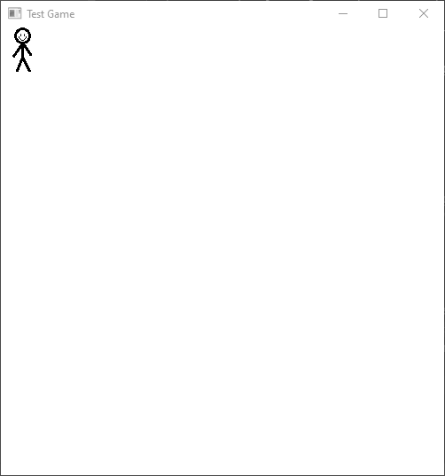

# javafxgamehelper

 - Easily make canvas-based games in JavaFX

## Tutorial

1.  In order to get started you will need the packages. 
    You can either clone this repository and 
    copy over them over from `/src/main`, or download 
    [JavaFXGameHelper-1.0-SNAPSHOT.jar](JavaFXGameHelper-1.0-SNAPSHOT.jar) and 
    add it to your classpath. You will also need the files 
    from `/src/main/resources`. (the `sprites` folder can be emptied, 
    it will hold your game's sprites)
2.  Let's start off by making our main class `TestGame.java`, it has 
    to be a subclass of GameHelper, so we'll have something similar 
    to this
    ```Java    
    import com.kyle.javafxgamehelper.GameHelper;
    
    public class TestGame extends GameHelper {
          
    }
    ```
3.  Now let's make some assets to add into the game. These will be 
    defined in separate class files and all implement the `GameAsset` 
    interface. However, there is also a `DefaultAsset` class that 
    comes with some basic asset information, so I'm going to use that 
    instead in `SimpleAsset.java`
    ```Java
    import com.kyle.javafxgamehelper.DefaultAsset;
    
    public class SimpleAsset extends DefaultAsset {
        
        //  Constructor method
        public SimpleAsset(String[] sprites, String name) {
            super(sprites, name);
        }
    }
    ```
4.  Right now `SimpleAsset` is just a clone of default asset and doesn't 
    do anything special. Let's make use of the methods defined 
    in `GameAsset` to add more functionality to our class. The 
    `update()` method is called once every 35 ms by default, and 
    can be used to change asset information. Let's make it so that our 
    asset will drift across the canvas at a constant rate. 
    ```Java
    import com.kyle.javafxgamehelper.DefaultAsset;
    import com.kyle.javafxgamehelper.GameHandler;
    
    public class SimpleAsset extends DefaultAsset {

        public SimpleAsset(String[] sprites, String name) {
            super(sprites, name);
        }

        @Override
        public void update(Object data, GameHandler handler) throws InterruptedException {
            xPos += 2;
            if(xPos > handler.SCREEN_WIDTH) {
                xPos = 0;
            }
        }
    }
    ```
5.  Now, we can go back to `TestGame.java` and load our asset 
    into the game. In order to do that we only need to call one 
    method to set up the canvas game: `setGameData()`. It has a 
    few parameters: first, it needs to know where to find the 
    canvas script; then, information about the JavaFX window; 
    and finally, information about the game itself.
    ```Java
    import com.kyle.javafxgamehelper.GameHelper;
    import com.kyle.javafxgamehelper.GameAsset;
    
    public class TestGame extends GameHelper {
         
        public static void main(String ... args) {
            setGameData(pathToCanvas,
                windowTitle, screenWidth, screenHeight,
                gameSprites, gameAssets, updateObject);
        }    
    }    
    ```
6.  Game sprites and assets are sent as a String[] and a 
    GameAsset[] respectively. Let us create them with an instance of 
    out simple asset object. The sprites must be declared separately 
    and should ideally include all sprites that are going to be used 
    in your game, so they can all be loaded at once. I have made a 
    separate sprite image and placed it in `/src/main/resources/sprites`, 
    but it can go wherever you have placed the rest of the canvas 
    resources. Now that we have all the parameters for `setGameData()`, 
    we can go ahead and call `launch(args)` to start the game.
    ```Java
    import com.kyle.javafxgamehelper.GameHelper;
    import com.kyle.javafxgamehelper.GameAsset;
    
    public class TestGame extends GameHelper {
         
        public static void main(String ... args) {
            String[] gameSprites = {
                "image.png"
            };
    
            GameAsset[] gameAssets = {
                new SimpleAsset(
                        new String[]{"image.png"},
                        "test asset"
                )
            };
    
            setGameData("src/main/resources/index.html",
                "Test Game", 500, 500,
                gameSprites, gameAssets, new Object());
    
            launch(args);
        }    
    }    
    ```
7.  Here is a screen capture of the game in action:  
      
    Obviously, this isn't much of a game, but it shows how simple 
    it is to use the GameHelper class. I hope this library can 
    help to make designing canvas-based games with JavaFX a 
    bit simpler. It abstracts the canvas itself out of the
    programming process and helps reorient the design towards building
    object-oriented games by implementing the GameAsset interface and
    Object array. If you are interested and would like to learn more 
    about what's available in this package, feel free to check out the 
    highlights below and take a look at `com.kyle.demogame` 
    for an example of a working game. This covers a lot of stuff 
    that wasn't in this tutorial, like taking keyboard input and 
    using an updateObject. Sadly, mouse input is not supported yet, 
    but other than that, if you find any bugs or would like to 
    request a feature, please submit a pull request or issue~  

***Notes:***
 - *Canvas coordinates are specified X then Y, with the origin in the
  top left corner*
 - Why use a WebView and JS when JavaFX has a builtin canvas?
    - _shhh... you're not supposed to know that_
    - Why? I don't really have a great reason why.
    - Is there an impact on performance? I don't know, maybe. 
  
<hr>

## Package `com.kyle.javafxgamehelper`

### Class `GameHelper`
 - main class should be a subclass of `GameHelper`
 - _useful methods:_
   - **public static void setGameData(String canvasPath,
   String windowTitle, int screenWidth, int screenHeight,
   String[] sprites, GameAsset[] assets,
   Object gameUpdateObject)**
      - sets the required data for the game
      - this is the only *required* method call
       - _Params:_
         - String canvasPath - the location of 
           `/src/main/resources/index.html`
         - String windowTitle - the title of the JavaFX app window
         - int screenWidth, int screenHeight - the 
           dimensions of the canvas window
         - String[] sprites - the starting sprites used in the game
         - GameAsset[] assets - the starting assets
         - Object gameUpdateObject - an object sent to each assets'
           update() method containing additional game data
     
### Class `GameHelper.GameApp`
 - public static GameApp _game_
 - _useful methods:_  
   - **public void setFixedRate(int newRate)**
       - set the update rate
       - by default, all assets are updated at minimum of every 
         35 ms
       - int newRate - new rate in ms
   - **public void beginGame()**
       - load all assets and start update and drawing loop
       - only necessary if new sprites are added
   - **public void endGame()**
       - stop update loop
       - can be used to pause game (see `com.kyle.demogame.DemoGame`)

### Class `GameHandler`
 - this is used to interact with the canvas
 - is also sent to each asset's `update()` method
 - _useful methods:_
   - **public void addSprite(String sprite)**
       - String sprite - the sprite filename, relative to 
         `/src/main/resources/sprites` or the corresponding directory
   - **public void removeSprite(String sprite)**
       - String sprite - will remove the exact matching string, 
         if it exists
   - **public void addAsset(GameAsset asset)**  
   - **public void addAsset(GameAsset asset, int index)**
   - **public void removeAsset(String name)**
       - String name - unique asset name, otherwise 
         will remove only first asset with matching name
   - **public void setAssets(GameAsset[] assets)**
      - *Copy* over assets from array
   - **public int getNoSprites()**  
   - **public int getNoAssets()**

### Interface `GameAsset`
 - all assets must implement this interface in order 
   to be added to the canvas
 - _required methods:_
    - **double[] getPosition()**  
    - **String getSprite();**  
    - **String getName();**  
 - _optional methods:_
   - **default void update(Object data, GameHandler handler)**
       - called once at least every 35 ms, or as otherwise specified by
         `GameHelper.game.fixedRate`
   - **default void keyEventHandler(KeyEvent keyEvent)**
      - key events described in `javafx.scene.input.KeyEvent`

### Class `DefaultAsset`
 - a simple default asset that provides basic parameters
 - _Fields:_
   - protected final String[] sprites
   - protected final String name
   - protected double xPos = 0
   - protected double yPos = 0
 - _methods:_
   - **public DefaultAsset(String[] sprites, String name)**  
   - **public double[] getPosition()**
      - return xPos, yPos
   - **public String getSprite();**
      - return sprites[0]
   - **public String getName();**  
   
